<div align="center">



# my-lisp

**Маленька Lisp-мова, що вирощує себе**

*Дослідження того, наскільки малою може бути незвідна машина, якщо дедалі більше значення, правил і поведінки належить самій мові.*

<p><a href="https://github.com/juv4uk/my-lisp/releases/latest/download/my-lisp-cli-web.html"><strong>▶ Спробувати my-lisp у вебі</strong></a></p>
<sub>Один автономний portable-файл <code>.html</code> · без встановлення · працює локально у браузері</sub>

[](https://github.com/juv4uk/my-lisp/actions/workflows/ci.yml)
[](https://github.com/juv4uk/my-lisp/actions/workflows/wasm-browser-test.yml)
[](https://github.com/juv4uk/my-lisp/actions/workflows/surface-drift-check.yml)

**Українська — перша мова проєкту.** Англійська й німецька — допоміжні.

</div>

---

## Що таке `my-lisp`

`my-lisp` — дослідницька Lisp-мова з навмисно малим семантичним ядром, точною арифметикою, виконуваними законами та незалежними реалізаціями для перевірки припущень.

Головний архітектурний принцип:

> **Механізм може належати хосту. Значення має належати мові.**

Rust тут є **референсною реалізацією**, але не джерелом семантичної істини. Якщо поведінку можна виразити й перевірити всередині Lisp, вона повинна обґрунтувати, чому досі живе в хості.

```text
закон мови
    ↓
Lisp-визначення / виконуваний доказ
    ↓
референсна реалізація Rust
    ↓
незалежні субстрати: C / CML / FPGA / WASM / Racket
```

Поточний машинний семантичний контракт — [`language-contract.lisp`](language-contract.lisp), версія **6.0**.


### Один Lisp, різні субстрати

Поточний напрям substrate switch фіксує ще жорсткішу межу:

> **`my-lisp` лишається семантичною владою; субстрат змінюється без міграції значення.**

Тобто перенесення виконання на GraalVM, WASM, C, FPGA чи інший host не повинно породжувати другу реалізацію мови. Новий субстрат має виконувати той самий pinned Lisp source і доводити це незалежним witness-шаром.

```text
pinned my-lisp source
        ↓
semantic contract + executable laws
        ↓
      substrate
   ↙      ↓      ↘
 Rust   GraalVM   WASM / C / FPGA
```

Особливо це стосується bootstrap: `lib/macro.lisp` і `lib/core.lisp` є Lisp-owned behavior. Якщо для запуску на іншому субстраті потрібен новий host-механізм, він має бути вузьким, незвідним і semantics-blind; переписування `COND`, `defmacro`, `let`, `equal?` чи іншої Lisp-поведінки в Java/Rust не є еквівалентним substrate switch.

Поточний bootstrap рухається до канонічного **тричленного `COND`** — `(query expected-result expression)`: структурні та identity-рішення порівнюються з явним результатом, а не через загальну truthiness. Перший upstream-крок для `lib/macro.lisp` проходить через PR [`#615`](https://github.com/juv4uk/my-lisp/pull/615); це ще не є оголошенням зеленого CI.

---

## Що вже доведено

Три терміни, на яких тримається evidence layer:

- **semantic ID** — стабільна числова тотожність значення, незалежна від написання імені;
- **surface** — шар написань/проєкцій, який відображає імена на semantic IDs;
- **witness** — виконуваний доказ, що перевіряє конкретне обмежене семантичне твердження.

На сьогодні README може чесно показати такі вже ратифіковані результати:

- **Canon 0+7 має executable witnesses.** Закони замкненого ядра не лише описані прозою: вони виконуються в [`lib/canon.lisp`](lib/canon.lisp) і перевіряються conformance/Canon-тестами.
- **Українська поверхня є peer projection тих самих numeric semantic identities.** `uk`, `en`, `sa` та інші admitted spellings не створюють окремих значень і не перекладають «привілейовану англійську семантику»; authority лежить у numeric-only registry [`lib/surface/semantic-registry.lisp`](lib/surface/semantic-registry.lisp).
- **Vertical Day — bounded фізичний доказ.** Ратифікований зріз [`2026-09-14`](docs/research/2026-09-14-vertical-day.md) проводить `(перше (сполучити 2 3))` через structured machine forms → closed admission → Lisp-owned x86-64 encoding → semantics-blind host → physical CPU і отримує `2`. Це доказ конкретного bounded шляху, не твердження про повну native Lisp-машину.
- **Canonical machine path fail-closed.** Ill-typed semantic input та raw/malformed/unadmitted, зокрема truncated, machine requests відхиляються до входу в host; негативні witnesses фіксують `HOST CALL COUNT = 0`, а не використовують crash як oracle.

```text
(перше (сполучити 2 3))
        ↓
semantic identity
        ↓
structured machine forms
        ↓
closed admission
        ↓
Lisp-owned x86-64 encoding
        ↓
semantics-blind host
        ↓
physical CPU
        ↓
2
```

**Ще не доведено:** complete native GC/general heap, first-class escaping native pairs, automatic GPU/FPGA scheduler, complete Lisp machine або OS. Повний список меж твердження й exact evidence ledger лежить у датованому [`Vertical Day record`](docs/research/2026-09-14-vertical-day.md).

README лише показує вже зароблені докази; він не є новим джерелом семантичної влади.

---

## Canon 0 + 7

Семантичне ядро замкнене. Є **Canon 0** — конкретний порожній правильний список `()` — і рівно сім канонічних операцій Маккарті.

| Канонічна тотожність | Українська поверхня | Символ з української розкладки | Історичне ім'я |
|---|---|---:|---|
| Canon 0 | `()` | `()` | `()` |
| QUOTE | `як-є` | `'` | `quote` |
| ATOM | `атом?` | `.?` | `atom` |
| EQ | `тотожне?` | `=?` | `eq` |
| CONS | `сполучити` | `:` | `cons` |
| CAR | `перше` | `:п` | `car` |
| CDR | `решта` | `:р` | `cdr` |
| COND | `за-умовою` | `?:` | `cond` |

`() ` — **не восьмий примітив**. Це первинний об'єкт і база індукції для правильних списків.

Символи також не створюють нових примітивів: `'`, `.?`, `=?`, `:`, `:п`, `:р`, `?:` — це компактні написання тих самих канонічних тотожностей. Виконуваний доказ лежить у [`lib/canon.lisp`](lib/canon.lisp).

`QUOTE` і `COND` керують обчисленням і не маскуються під звичайні callable values.

### Апостроф

Контракт 4.0 фіксує просте правило:

```lisp
'кіт        ; те саме, що (quote кіт)

об'єкт      ; один ідентифікатор
п'ять       ; один ідентифікатор
зв'язок     ; один ідентифікатор
```

Апостроф на початку виразу — reader syntax для `QUOTE`; апостроф усередині слова — звичайна частина ідентифікатора.

### Десяткова кома

На українській розкладці десятковий роздільник можна набирати комою. Крапка й кома є двома написаннями **того самого точного числового значення**:

```lisp
(eq 12,455 12.455)   ; t
(+ 1,5 2,5)          ; 4
(eq -0,25 -0.25)     ; t
(eq 1,5e3 1500)      ; t
```

Кома отримує числовий сенс лише тоді, коли весь токен є коректним числом. Тому `а,б` і `версія1,2` лишаються звичайними символами.

---

## Українською можна програмувати

Українська — не лише мова README. Українські імена є peer-проєкціями тих самих numeric semantic IDs у [`lib/surface/semantic-registry.lisp`](lib/surface/semantic-registry.lisp); вони не створюють окремої реалізації функцій.

У проєкті розрізняються **дві українські поверхні**:

- `uk` — коротка, інтуїтивно зрозуміла українська поверхня для щоденного програмування;
- `ukr` — повна українська поверхня, де ім'я максимально явно описує операцію.

Обидві належать **тому самому semantic ID**. Якщо чинне `uk`-ім'я вже коротке й ясне, `uk` і `ukr` можуть бути однаковими. Якщо повна назва краще пояснює дію, `ukr` може бути довшою:

| byte SID | `uk` | `ukr` |
|---:|---|---|
| `00000010` | `атом?` | `атом?` |
| `00001001` | `визначити` | `визначити` |
| `00111100` | `текст-порожній?` | `порожній-текст?` |
| `01011010` | `монотонний-нс` | `монотонний-час-у-наносекундах` |
| `01011110` | `поточний-всч` | `поточний-всесвітній-координований-час` |

Кожен слот у реєстрі містить ім'я або `()`. `()` означає лише відсутність surface. Якщо ім'я існує в реєстрі — воно маршрутизується до відповідного SID.

Повна жива таблиця `uk | ukr | English | Sanskrit` генерується з authority: [`docs/generated/function-table.md`](docs/generated/function-table.md). Детальні пояснення поведінки: [`docs/ukrainian-api.md`](docs/ukrainian-api.md). Репрезентативний executable witness без перемикання на латинську розкладку: [`lib/surface/ukr-acceptance.lisp`](lib/surface/ukr-acceptance.lisp).

Окремо [`docs/generated/public-api-discovery.md`](docs/generated/public-api-discovery.md) рекурсивно показує всі знайдені top-level `def`/`defmacro` у живому `lib/**/*.lisp`. Його рядки поки мають статус `unreviewed`: discovery не оголошує функцію публічною і не створює semantic ID.

Поточний код через stable `uk` може виглядати так:

```lisp
(визначити квадрат
  (функція (число)
    (помножити число число)))
```

### Предикати читаються як питання

Українська назва предиката закінчується `?`. На своїй припустимій області предикат повертає тільки канонічне `t` або `()`:

```lisp
(атом? 'кіт)                         ; t
(менше? 2 5)                         ; t
(значення-у-списку? 'пес (список 'кіт 'пес))   ; t
```

`?` — частина ідентифікатора, а не окремий оператор. Функції, що можуть повернути дані або `()` (наприклад `отримати-з-карти`), предикатами не є й `?` не мають.

Повна самоперевірна українська програма є в [`lib/surface/uk-acceptance.lisp`](lib/surface/uk-acceptance.lisp).

Українська, англійська та санскритська **програмні поверхні не розмножують семантику**. Вони відображають різні імена на ті самі визначення й канонічні тотожності. Єдина машинна таблиця відповідності лежить у [`lib/surface/semantic-registry.lisp`](lib/surface/semantic-registry.lisp): semantic identity там numeric-only, а спільна пунктуація винесена в окрему `sym`-поверхню.

Є й програмний перекладач поверхонь:

```bash
python3 scripts/translate-program.py --from en --to uk input.lisp
python3 scripts/translate-program.py --from uk --to sa input.lisp
```

Він підтримує всі шість напрямків між `en`, `uk` і `sa`, зберігаючи форматування, коментарі, рядки та невідомі користувацькі символи. Деталі: [`docs/program-surface-translator.md`](docs/program-surface-translator.md).

---

## Мовна політика репозиторію

Людська комунікація проєкту має окрему ратифіковану політику: [`knowledge/language-policy.lisp`](knowledge/language-policy.lisp).

```text
1. Українська — перша і головна.
2. Англійська й німецька — допоміжні.
3. Текстові файли репозиторію — UTF-8.
4. Нові коментарі в коді — українською кирилицею.
5. Точні API, protocol literals, identifiers, filenames і upstream-назви не перекладаються довільно.
```

[`scripts/uk-latynka.py`](scripts/uk-latynka.py) лишається оборотним ASCII-інструментом для спеціальних зовнішніх меж без Unicode. Це **не** штатний стиль коментарів у репозиторії.

---

## Семантична влада

README пояснює проєкт, але не визначає його семантику.

```text
language-contract.lisp
        ↓
ратифіковані ADR
        ↓
виконувані закони та conformance fixtures
        ↓
референсна реалізація Rust
        ↓
незалежні реалізації
        ↓
згенерована документація
        ↓
README / tutorials / історичні плани
```

Якщо нижчий рівень суперечить вищому — нижчий рівень застарів. Повна карта: [`docs/semantic-authority-map.md`](docs/semantic-authority-map.md).

Це одна з головних дисциплін проєкту:

> **Назва явища не може бути сильнішою за найсильніший експеримент, який його підтримує.**

---

## Мова, що вирощує себе

У `my-lisp` дедалі більше систем живе не в Rust, а в самій мові:

| Шар | Де дивитися | Що там |
|---|---|---|
| Bootstrap | [`lib/core.lisp`](lib/core.lisp), [`lib/macro.lisp`](lib/macro.lisp) | базова бібліотека, макроси |
| Canon | [`lib/canon.lisp`](lib/canon.lisp) | виконувані закони 0+7 |
| Meta-eval | [`lib/meta-eval.lisp`](lib/meta-eval.lisp) | метациркулярне обчислення, finite mutual recursion |
| Логіка | [`lib/unify.lisp`](lib/unify.lisp), [`lib/reason.lisp`](lib/reason.lisp) | уніфікація, backward reasoning |
| Forward reasoning | [`lib/forward.lisp`](lib/forward.lisp) | forward chaining / JTMS |
| Знання | [`lib/knowledge.lisp`](lib/knowledge.lisp), [`lib/world.lisp`](lib/world.lisp) | модулі знань, незмінні світи |
| Епістеміка | [`lib/epistemic.lisp`](lib/epistemic.lisp) | явні стани знання й невизначеності |
| Мова ↔ текст | [`lib/understand.lisp`](lib/understand.lisp), [`lib/narrate.lisp`](lib/narrate.lisp) | контрольовані мовні мости |
| Час | [`lib/time.lisp`](lib/time.lisp) | дедалі більше language-owned time semantics |

Головне питання не «скільки рядків уже переписано на Lisp?», а:

> **Якою мінімальною може бути незвідна хост-машина, якщо корисна система продовжує вирощуватися всередині самої мови?**

---

## Advice Taker і reasoning-напрям

Один із центральних дослідницьких напрямів — не просто інтерпретувати S-вирази, а будувати систему, яка може працювати зі знанням, доказами, суперечностями й поясненнями.

```text
факти / правила
      ↓
   unify.lisp
      ↓
  reason.lisp  ←→  forward.lisp
      ↓
 knowledge.lisp / world.lisp
      ↓
 advice / proof / provenance
```

Саме тут маленьке Lisp-ядро перевіряється не «hello world», а реальною композицією рекурсії, символічного reasoning, immutable state та knowledge layers.

---

## Хост не є семантикою

`my-lisp` не ставить собі за мету механічно «переписати Rust на Lisp». Межа інша:

```text
OS / hardware
      ↓
спостереження та capability-механізми
      ↓
значення my-lisp
      ↓
Lisp-визначена інтерпретація / політика / протокол
```

Тому низькорівнева операція може чесно лишатися в Rust, C або FPGA, якщо вона є механізмом. Але semantic policy не повинна випадково ставати властивістю конкретного хоста.

Живий аудит цієї межі: [`docs/host-semantic-surface.md`](docs/host-semantic-surface.md).

---

## Незалежні субстрати

Різні реалізації потрібні не для того, щоб копіювати одну архітектуру, а щоб **ламати приховані припущення одна одної**.

- [`crates/my-lisp`](crates/my-lisp) — референсний Rust runtime;
- [`crates/my-lisp-cli`](crates/my-lisp-cli) — CLI, REPL і semantic oracle;
- [`crates/my-lisp-wasm`](crates/my-lisp-wasm) — WebAssembly;
- [`crates/my-lisp-lsp`](crates/my-lisp-lsp) — LSP;
- [`crates/my-lisp-host`](crates/my-lisp-host) — явна межа OS capabilities;
- [`c-runtime/`](c-runtime/) — C + x86_64 substrate;
- [`racket/`](racket/) — `#lang my-lisp` для Racket/DrRacket;
- [`juv4uk/cml`](https://github.com/juv4uk/cml) — AOT / heterogeneous compiler напрям;
- [`juv4uk/fpga-lisp`](https://github.com/juv4uk/fpga-lisp) — фізично інша Lisp-машина на FPGA.

Сумісність визначається контрактами, а не тим, наскільки схожий код реалізацій.

---

## Локальний запуск

Потрібні Rust toolchain і залежності workspace. У репозиторії також є Guix manifest для відтворюваного середовища.

```bash
# REPL
cargo run -p my-lisp-cli

# виконати файл
cargo run -p my-lisp-cli -- path/to/file.lisp

# повний workspace
cargo test --workspace
cargo build --workspace
cargo clippy --workspace --all-targets -- -D warnings
```

Канонічне розширення вихідного коду — **`.lisp`** (згідно з [my-lisp#81](https://github.com/juv4uk/my-lisp/issues/81)). **`.wsm`** і **`.my`** лишаються повністю підтримуваними legacy aliases.

---

## З чого читати проєкт

Якщо відкриваєте `my-lisp` уперше, цей порядок дає найменше плутанини:

1. [`language-contract.lisp`](language-contract.lisp) — що саме обіцяє мова;
2. [`docs/semantic-authority-map.md`](docs/semantic-authority-map.md) — хто має право визначати істину;
3. [`lib/canon.lisp`](lib/canon.lisp) — виконуваний Canon 0+7;
4. [`docs/language-core.md`](docs/language-core.md) — компактна архітектура ядра;
5. [`lib/surface/uk-acceptance.lisp`](lib/surface/uk-acceptance.lisp) — українська мова як виконуваний програмний інтерфейс;
6. [`lib/meta-eval.lisp`](lib/meta-eval.lisp) — як мова починає обчислювати саму себе;
7. [`lib/reason.lisp`](lib/reason.lisp) — reasoning-напрям;
8. [`tests/fixtures/conformance.lisp`](tests/fixtures/conformance.lisp) — спостережувані факти, які мають пережити зміну реалізації.

Додатково:

- [`docs/testing.md`](docs/testing.md) — карта тестів;
- [`docs/benchmarks.md`](docs/benchmarks.md) — методика вимірювань;
- [`docs/adr/ADR-004-CLOSED-MCCARTHY7-CORE.md`](docs/adr/ADR-004-CLOSED-MCCARTHY7-CORE.md) — чому ядро 0+7 замкнене;
- [`docs/mccarthy-vision.md`](docs/mccarthy-vision.md) — історичний контекст і свідомі відхилення;
- [`AGENTS.md`](AGENTS.md) — правила роботи агентів у репозиторії;
- [`knowledge/guard-reference.lisp`](knowledge/guard-reference.lisp) — машинно-читане довідкове бюро Guard.

---

## English · auxiliary

`my-lisp` is a Lisp research language built around a permanently closed McCarthy 0+7 semantic nucleus, exact arithmetic, executable conformance, language-owned semantics, and independent substrates used to falsify implementation-specific assumptions.

Ukrainian is the project's primary human language. English and German are auxiliary. The Rust runtime is the reference implementation, not semantic authority; start with [`language-contract.lisp`](language-contract.lisp) and [`docs/semantic-authority-map.md`](docs/semantic-authority-map.md).

The central research question is: **how small can the irreducible host remain while the useful system continues to grow inside the language?**

## Deutsch · ergänzend

`my-lisp` ist eine Lisp-Forschungssprache mit einem dauerhaft geschlossenen semantischen McCarthy-Kern 0+7, exakter Arithmetik, ausführbarer Konformität und mehreren unabhängigen Substraten.

Ukrainisch ist die primäre menschliche Sprache des Projekts; Englisch und Deutsch sind Hilfssprachen. Rust ist die Referenzimplementierung, aber nicht die semantische Autorität. Maßgeblich sind [`language-contract.lisp`](language-contract.lisp), ratifizierte Entscheidungen und ausführbare Konformitätsbelege.

Die zentrale Forschungsfrage lautet: **Wie klein kann der irreduzible Host bleiben, während das nützliche System innerhalb der Sprache weiterwächst?**

---

## Ліцензія

[ВОЛЬНІСТЬ](LICENSE)
