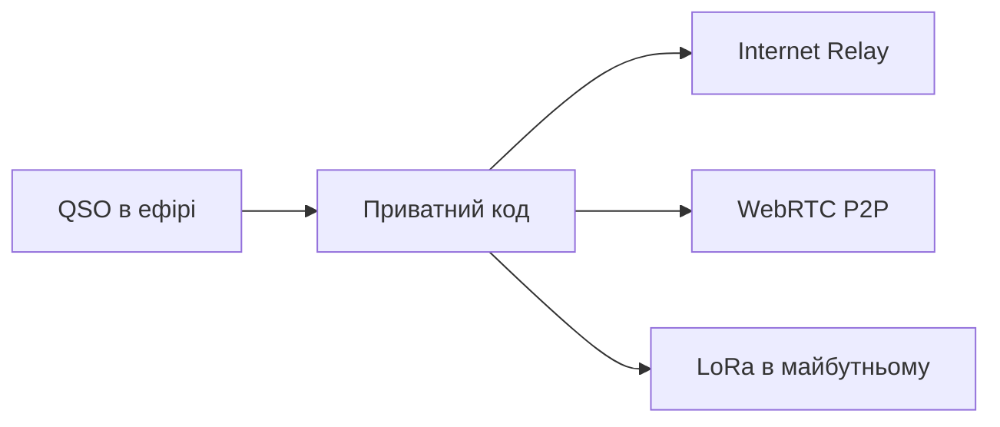

# Signal & Radio Log

<p align="center">
  
</p>

<p align="center">
  <strong>Менше писати. Більше працювати в ефірі.</strong><br>
  <em>Type less. Spend more time on air. · Weniger tippen. Mehr Zeit auf Sendung.</em>
</p>

<p align="center">
  <a href="https://github.com/juv4uk/my-ide/releases"></a>
  <a href="https://github.com/juv4uk/my-ide/actions"></a>
  <a href="LICENSE"></a>
</p>

---

## Що це?

**Signal & Radio Log** — простий офлайн-журнал для радіоаматора. Він допомагає швидко записати QSO, не відволікаючись від ефіру: введіть позивний, торкніться діапазону й режиму, перевірте RST — готово.

Застосунок особливо любить **QRPp**: зв’язки на 500, 100 або навіть 50 мВт. Але це не обмеження — журнал чесно збереже будь-яку потужність.

Ваші записи залишаються на вашому пристрої. Обліковий запис та інтернет для роботи не потрібні.

### Для кого

- для першого QSO і першого власного журналу;
- для роботи в полі, SOTA/POTA та портативної станції;
- для QRP/QRPp-експериментів;
- для тих, хто хоче поступово освоїти Markdown, таблиці та Mermaid;
- для операторів, яким потрібен простий ADIF без перевантаженого інтерфейсу.

## Що вже вміє

### Швидкий журнал

- великі кнопки для діапазону, режиму й потужності;
- автоматичні UTC-дата і час;
- зручна робота одним пальцем;
- портретна й альбомна орієнтації;
- пошук, редагування та видалення QSO;
- кольорові позначки QRPp і QRP.

### ADIF без пасток

- імпорт `.adi` та `.adif`;
- експорт ADIF 3.1.7;
- підтримка `TX_PWR`, локаторів, RST та основних полів QSO;
- невідомі ADIF-поля зберігаються під час імпорту й повторного експорту.

### Нотатки, які навчають

Пишіть звичайний Markdown і одразу бачте результат. Готові шаблони допоможуть створити:

- звіт про QSO;
- таблицю контактів або антен;
- QRPp-експеримент;
- сходинки потужності;
- Mermaid-схему станції.

### Три мови

Українська, English і Deutsch перемикаються одним торканням. Це не лише локалізація: знайомі слова трьома мовами поступово запам’ятовуються просто під час роботи.

## Спробувати

Завантажте останню версію на сторінці **[Releases](https://github.com/juv4uk/my-ide/releases)**.

Збірки готуються для:

| Платформа | Формат |
|---|---|
| Windows | `.msi`, `.exe` |
| Linux | `.deb`, `.rpm`, `.AppImage`, `.flatpak` |
| macOS | `.dmg` |
| Android | `.apk` |
| iOS | `.app` для Simulator |
| Raspberry Pi / ARM64 | Linux-пакети |
| Web | статична збірка |

> Доступність окремого файла залежить від успішної збірки відповідної платформи в GitHub Actions.

## Що далі

Ми готуємо **QSO Connect** — спосіб продовжити знайомство після ефірного QSO через приватний код. Основа протоколу вже підтримує зашифровані повідомлення та змінні канали зв’язку:



Це поки фундамент, а не готовий чат у застосунку. Головний принцип незмінний: журнал має повноцінно працювати офлайн.

<details>
<summary><strong>English</strong></summary>

## What is it?

**Signal & Radio Log** is a small offline-first logbook for amateur-radio operators. It keeps QSO entry out of your way: enter a callsign, tap the band and mode, check the RST, and save.

The app has a special place for **QRPp** experiments at 500, 100, or even 50 mW, while still recording contacts at any power. Your log remains on your device; no account or internet connection is required.

### Highlights

- thumb-friendly mobile QSO entry;
- portrait, landscape, tablet, and desktop layouts;
- ADIF 3.1.7 import and export with unknown-field preservation;
- QRPp/QRP power badges and milliwatt presets;
- searchable and editable logbook;
- Markdown notes with live preview;
- learning templates for tables, QRPp experiments, power ladders, and Mermaid station diagrams;
- Ukrainian, English, and German with one-tap switching;
- builds for Windows, Linux, macOS, Android, iOS Simulator, ARM64, and the web.

Download the latest build from **[Releases](https://github.com/juv4uk/my-ide/releases)**.

### Coming later

The project includes the encrypted protocol foundation for **QSO Connect**. Internet relay comes first; WebRTC P2P and LoRa can later use the same transport-independent message format. The chat UI and public relay service are not available yet.

</details>

<details>
<summary><strong>Deutsch</strong></summary>

## Was ist das?

**Signal & Radio Log** ist ein kleines Offline-Logbuch für Funkamateure. Ein QSO lässt sich schnell erfassen: Rufzeichen eingeben, Band und Betriebsart antippen, RST prüfen und speichern.

Die App eignet sich besonders für **QRPp**-Experimente mit 500, 100 oder sogar 50 mW, speichert aber selbstverständlich Verbindungen mit jeder Leistung. Das Logbuch bleibt auf dem eigenen Gerät; Konto und Internetverbindung sind nicht erforderlich.

### Funktionen

- mobilfreundliche QSO-Eingabe mit großen Schaltflächen;
- Hochformat, Querformat, Tablet und Desktop;
- ADIF-3.1.7-Import und -Export mit Erhalt unbekannter Felder;
- QRPp/QRP-Kennzeichnung und Milliwatt-Schnellauswahl;
- durchsuchbares und bearbeitbares Logbuch;
- Markdown-Notizen mit Live-Vorschau;
- Lernvorlagen für Tabellen, QRPp-Experimente, Leistungsleitern und Mermaid-Stationsdiagramme;
- Ukrainisch, Englisch und Deutsch mit Umschaltung durch einmaliges Antippen;
- Builds für Windows, Linux, macOS, Android, iOS Simulator, ARM64 und Web.

Die aktuelle Version steht unter **[Releases](https://github.com/juv4uk/my-ide/releases)** bereit.

### Später geplant

Das Projekt enthält bereits die verschlüsselte Protokollgrundlage für **QSO Connect**. Zuerst ist ein Internet-Relay vorgesehen; später können WebRTC P2P und LoRa dasselbe transportunabhängige Nachrichtenformat verwenden. Chat-Oberfläche und öffentlicher Relay-Dienst sind noch nicht verfügbar.

</details>

---

## Для розробників · For developers · Für Entwickler

```bash
npm install
npm run dev
```

Перевірки · Checks · Prüfungen:

```bash
npm test
npm run check
npm run build
cargo check --manifest-path src-tauri/Cargo.toml
```

Основний стек: [Tauri 2](https://v2.tauri.app/), [SvelteKit](https://svelte.dev/docs/kit), TypeScript і Rust.

Внески, перевірка на різних пристроях, переклади та радіоаматорський досвід вітаються. Якщо знайшли проблему або маєте просту корисну ідею — відкрийте **[Issue](https://github.com/juv4uk/my-ide/issues)**.

## Ліцензія · License · Lizenz

[MIT](LICENSE) — користуйтеся, вивчайте й покращуйте.
